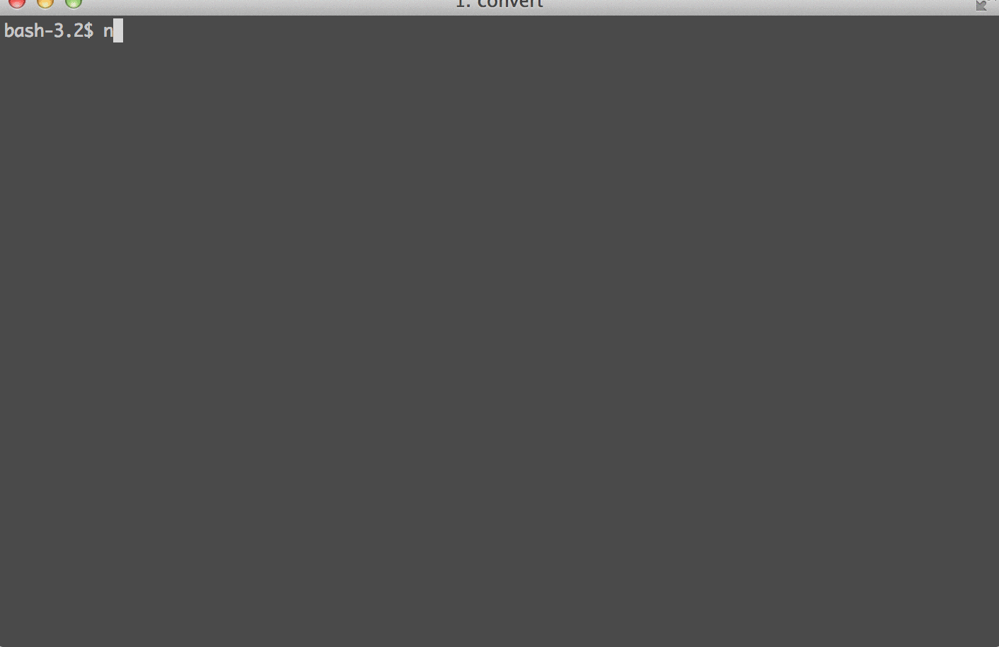

Screenliner
===

### example usage:

test.js:

```js
var Screenliner = require('./');
var screenliner = new Screenliner();
var Promise = require('bluebird');
var fs = require('fs');

var repeat = function(str, times) {
  return new Array(times + 1).join(str);
};

var lineStr = new Array(screenliner.width + 1).join('-');

screenliner.createRegion(lineStr);
var top = screenliner.createRegion();
screenliner.createRegion(lineStr);
var middle = screenliner.createRegion()
var middle2 = screenliner.createRegion()
screenliner.createRegion(lineStr);
var bottom = screenliner.createRegion();
screenliner.createRegion(lineStr);

var sleep = function(ms) {
  return new Promise(function(res) { setTimeout(res, ms); });
}

top.print('This is top - pending');
middle.print('This is middle - pending');
middle2.print('This is middle2 - status - ');
bottom.print('This is bottom - pending');

var timers = [];
timers.push(sleep(Math.random() * 3000).then(function() {
  top.replace('pending', '√');
}));

timers.push(sleep(Math.random() * 3000).then(function() {
  middle.replace(/pending/, '√');
}))
timers.push(sleep(Math.random() * 3000).then(function() {
  middle2.print('√', true); // appends
}))

timers.push(sleep(Math.random() * 3000).then(function() {
  bottom.print('√'); // replaces
}));

Promise.all(timers).then(function() {
  return sleep(500);
}).then(function() {
  fs.writeFileSync('screen.txt', screenliner.getScreenState().join('\n'));
  console.log('done!');
});

```

Produces:
